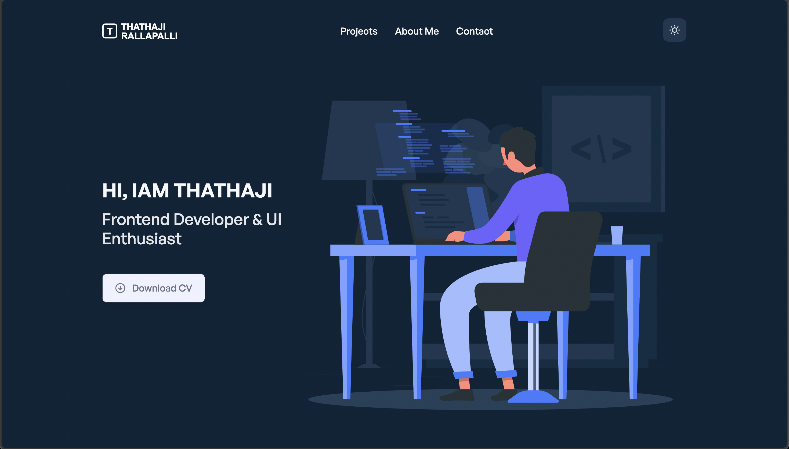

# Thathaji Rallapalli – Frontend Developer Portfolio

Welcome to my personal portfolio website built with **React**, **Tailwind CSS**, and **Framer Motion**.  
It highlights my work as a frontend developer, including my experience, tech stack, selected projects, and blog. The goal is to showcase not just my technical skills, but also my passion for clean design and scalable UI development.

---

## 🚀 Tech Stack

- React 18
- TypeScript
- JavaScript
- Tailwind CSS 3
- React Router
- Redux State Management
- Material UI (MUI)
- React Hook Form
- Recharts / D3.js

---

## 📁 Features

- Modern, mobile-friendly layout with smooth transitions
- Modular project and experience sections
- Dynamic UI rendered from configuration files
- Blog section integrated with [Hashnode](https://otp-autofill-tech.hashnode.dev/)
- Resume download and contact form
- Easy to customize and extend

---

## 📸 Preview

> ## 📸 Preview



Check out the live site: [https://portfolio-thathaji.vercel.app/](https://portfolio-thathaji.vercel.app/)

---

## 🔧 Getting Started

To run this project locally:

```bash
git clone https://github.com/Thathaji9/react-portfolio-thathaji.git
cd react-portfolio-thathaji
npm install
npm start
```

---

## 🙏 Credits

This portfolio is based on the awesome open-source template by [Stoman](https://github.com/realstoman), customized and extended by **Thathaji Rallapalli** for personal use.
